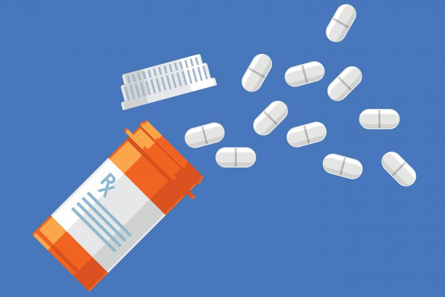

# Welcome to PharmaSense AI!

- [Welcome to PharmaSense AI!](#welcome-to-pharmasense-ai)
  - [Overview](#overview)
  - [Presentation Slides](#presentation-slides)
  - [Set-up Instructions](#set-up-instructions)
  - [Group Members](#group-members)

## Overview

"Admissions due to DRPs have been reported as growing over the past decades. In United States, estimates suggested that Drug-related problems (DRPs) accounted for 17 million emergency department visits and 8.7 million hospital admissions annually." -NIH

Pharmasense AI aims to use AI to detect potential drug interactions, alerting both the patient and healthcare providers about any potential complications with any combination of medications or supplements.

This is for the purpose of reducing risk of adverse drug events, enhancing patient safety, supporting accurate and informed prescribing, improving efficiency in clinical decision-making, and strengthening provider-patient communication.

## Presentation Slides

Here are our presentation slides: <https://docs.google.com/presentation/d/16ZitUTX_etUuWYf-bBnUbBZGRjUFJhW70R-tifPpJEw/edit?usp=sharing>

## Set-up Instructions

Ensure you have your own openrouter api key

Run from the terminal
- install nodejs npm 
- pip3 install -r requirements.txt
- cd AssignmentRepoDemo (from YashSonar20's GitHub)
- cd AiMedTracker 
- cd backend 
- npm run dev
- cd ..
- cd frontend
- npm run dev
- ctrl + click the link in the terminal

## Group Members

- Thomas Yang
- Yash Sonar
- Ayush Purankar
- Leiliani Clark
- Trinitey Tran
